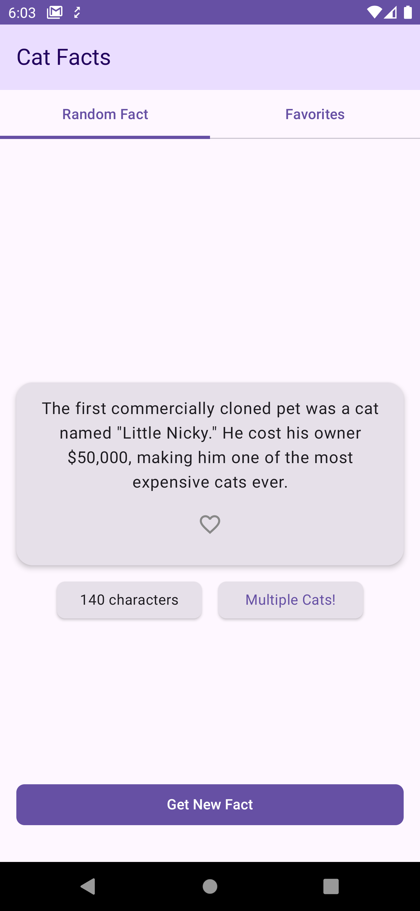
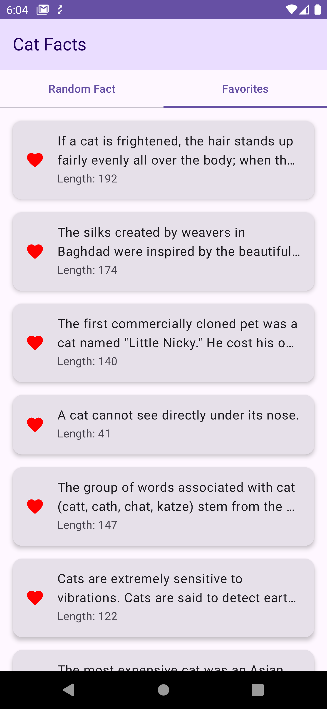
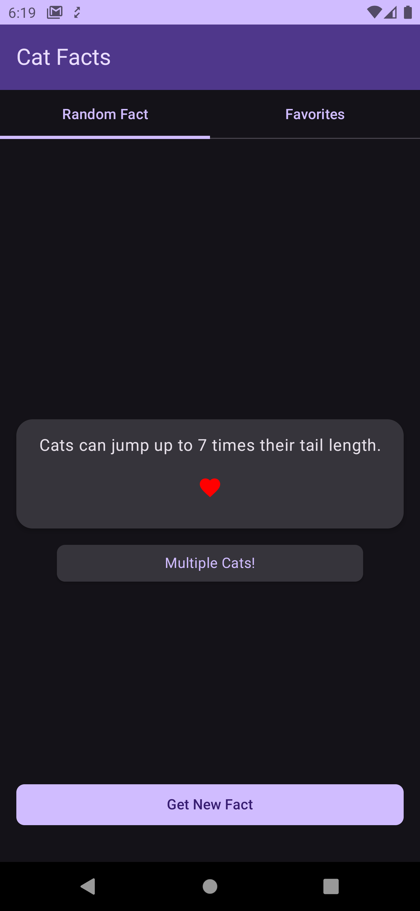
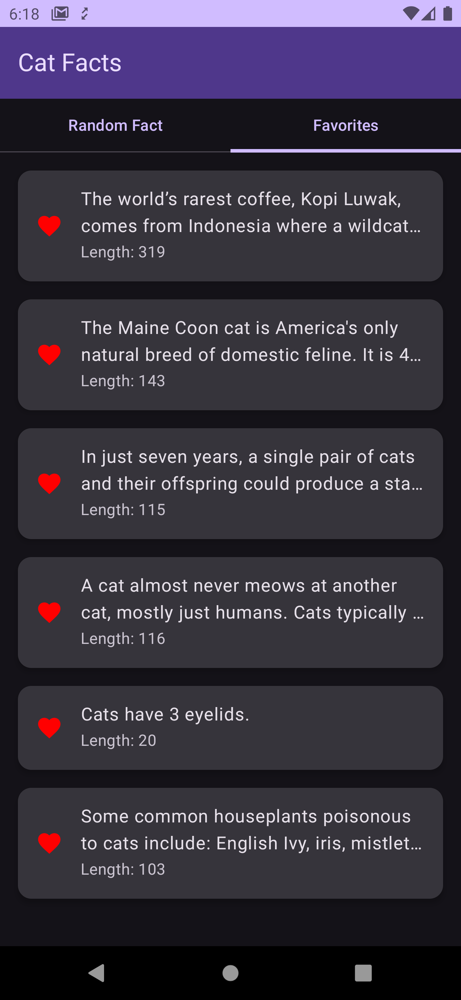

# Edison Android Exercise

## About This App

Edison Android Exercise is a modern Android application that showcases best practices in Android development. The app fetches random cat facts from an open API and allows users to interact with them in various ways, including viewing additional information and managing a list of favorite facts.

## Screenshots

| Random Fact Screen                                                                       | Favorite Facts Screen                                                                        |
|------------------------------------------------------------------------------------------|----------------------------------------------------------------------------------------------|
|  <br> *Random Fact - Light Mode*    |  <br> *Favorite Facts - Light Mode*    |
|  <br> *Random Fact - Dark Mode* |  <br> *Favorite Facts - Dark Mode* |


## Features

- **Display Random Cat Facts**: Fetches and displays random cat facts from the internet.
- **Additional Info for Long Facts**: Shows extra information for facts longer than 100 characters.
- **Multiple Cats Indicator**: Indicates when a fact mentions multiple cats.
- **Refresh Facts**: Allows users to fetch new random facts.
- **Auto-load Latest Fact**: Automatically loads the latest fact when the app starts.
- **Manage Favorites**:
  - Mark facts as favorites.
  - View a list of favorite facts on a separate screen.
  - Remove facts from the favorites list.

## Architecture

The app is built with a modular architecture to promote scalability and maintainability. The modules are organized as follows:

- **App Module**: Entry point of the application.
- **Feature Modules**:
  - `fact`: Handles the app display, showing tab layouts for Random Fact and Favorite Facts.
  - `favoritefact`: Manages the favorite facts functionality.
  - `randomfact`: Manages the random facts functionality.
- **Core Modules**:
  - `common`: Contains common utilities and extensions.
  - `data`: Manages data sources and repositories.
  - `designsystem`: Includes reusable UI related and themes.
  - `domain`: Contains use cases.
  - `model`: Defines UI models used throughout the app.
  - `network`: Handles network operations and API interactions.
  - `database`: Manages local data storage with Room.
  - `ui-testing`: Contains UI tests for the app.

## Tech Stack

- **Language**: Kotlin
- **UI**: Jetpack Compose
- **Architecture Pattern**: MVVM (Model-View-ViewModel)
- **Dependency Injection**: Hilt
- **Asynchronous Programming**: Coroutines and Flow
- **Networking**: Retrofit
- **Local Storage**: Room Database
- **Build System**: Gradle with Kotlin DSL

## API Details

The app uses the [Cat Facts API](https://catfact.ninja/#/Facts/getFacts) to fetch random cat facts. The API is open and does not require any authentication or API keys.

## Installation Requirements

- **Android Studio**: Arctic Fox (2020.3.1) or later.
- **Minimum SDK**: 26
- **Target SDK**: 34
- **Compile SDK**: 34
- **Kotlin Version**: 1.9.24 or later

## Project Setup

1. **Clone the Repository**:

   ```bash
   git clone https://github.com/yourusername/edison-android-exercise.git
   ```

2. **Open the Project in Android Studio**:

  - Launch Android Studio.
  - Click on **File** > **Open**.
  - Navigate to the cloned repository folder and select it.
  - Click **OK** to open the project.

3. **Sync the Project**:

  - Android Studio should automatically prompt you to sync the project.
  - If not, click on **File** > **Sync Project with Gradle Files**.

## Building and Running

1. **Connect a Device or Start an Emulator**:

  - Connect your Android device via USB with USB debugging enabled.
  - Or start an Android Virtual Device (AVD) from the AVD Manager.

2. **Select Build Configuration**:

  - In the toolbar, select the **App** configuration from the run configurations dropdown menu.

3. **Run the App**:

  - Click the **Run** button (green play icon) in the toolbar.
  - Alternatively, use the keyboard shortcut **Shift + F10** (Windows/Linux) or **Control + R** (macOS).

   The app will build and deploy to your connected device or emulator.

## Testing

The project includes both unit tests and UI tests to ensure code quality and app stability.

### Running Unit Tests

1. **Via Android Studio**:

  - In the **Project** view, navigate to `app/src/test/kotlin`.
  - Right-click on the `kotlin` directory or a specific test class.
  - Select **Run 'Tests in 'test''**.

2. **Via Command Line**:

   ```bash
   ./gradlew testDebugUnitTest
   ```

### Running UI Tests

1. **Via Android Studio**:

  - In the **Project** view, navigate to `app/src/androidTest/kotlin`.
  - Right-click on the `kotlin` directory or a specific UI test class.
  - Select **Run 'Tests in 'androidTest''**.

   *Note: Ensure that an emulator or device is connected, as UI tests require a running Android environment.*

2. **Via Command Line**:

   ```bash
   ./gradlew connectedAndroidTest
   ```

## Recommendations for Future Features

- **Localization**: Add support for multiple languages to reach a wider audience.
- **Sharing Facts**: Allow users to share their favorite cat facts via social media or messaging apps.
- **Push Notifications**: Send daily notifications with a new cat fact.

## Additional Resources

- **Cat Facts API Documentation**: [https://catfact.ninja/#/Facts/getFacts](https://catfact.ninja/#/Facts/getFacts)
- **Jetpack Compose Documentation**: [https://developer.android.com/jetpack/compose](https://developer.android.com/jetpack/compose)
- **Kotlin Coroutines Guide**: [https://kotlinlang.org/docs/coroutines-overview.html](https://kotlinlang.org/docs/coroutines-overview.html)
- **Hilt Dependency Injection**: [https://developer.android.com/training/dependency-injection/hilt-android](https://developer.android.com/training/dependency-injection/hilt-android)
